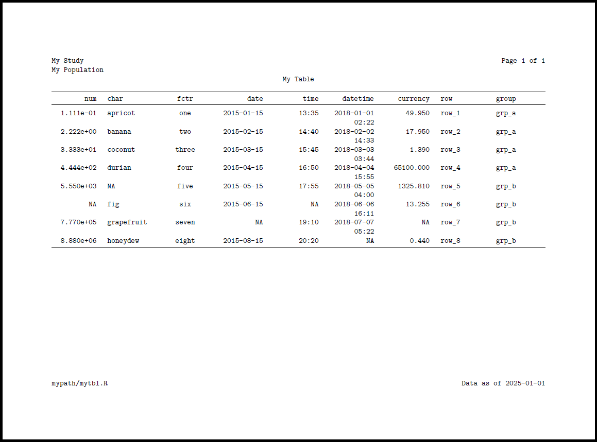

<!-- README.md is generated from README.Rmd. Please edit that file -->

```{r, include = FALSE}
knitr::opts_chunk$set(
  collapse = TRUE,
  comment = "#>",
  fig.path = "man/figures/README-",
  out.width = "100%"
)
```

# docorator <a href='https://gsk-biostatistics.github.io/docorator/'></a>


<!-- badges: start -->
[](https://github.com/GSK-Biostatistics/docorator/actions/workflows/R-CMD-check.yml) 
[](https://github.com/GIScience/badges#experimental)
<!-- badges: end -->

{docorator} is an engine for creating production displays from R. Specifically, {docorator} provides the following functionality:

- *Decorate*: Surround displays with document-level headers, footers, and page numbers
- *Output*: Export decorated displays to a file such as PDF or RTF

The main function, `as_docorator()` accepts an R object containing the display
as input. For best results with sizing, the table should be prepared via {gt},
or packages that interface with {gt} such as {tfrmt}, and the figure should be
prepared with {ggplot2}. Alternatively, the path to a PNG can be passed to
{docorator}. Specifically, the `x` should be one of the following:

  - `gt` table
  - `gt_group` (list of `gt` tables)
  - `ggplot2` figure
  - list of `ggplot` figures
  - path to PNG file (i.e. a previously created figure)
  - list of paths to PNG files

The `docorator` object, which is saved by default, can then be output using one
or both of the following render functions which can be piped together: `render_pdf()` and `render_rtf()`

# Use

```{r}
#| eval: false

# install from GitHub
devtools::install_github("GSK-Biostatistics/docorator")

# Load package
library(docorator) 

# Create table (or figure)
mytbl <- gt::exibble |> 
  gt::gt()

# Export display   
mytbl |> 
  as_docorator( 
    display_name = "mytbl",
    header = fancyhead(
      fancyrow(left = "My Study", center = NA, right = doc_pagenum()),
      fancyrow(left = "My Population", center = NA, right = NA),
      fancyrow(left = NA, center = "My Table", right = NA)
    ),
    footer = fancyfoot(
      fancyrow(left = "mypath/mytbl.R", center = NA, right = "Data as of 2025-01-01")
    ) 
  ) |> 
  render_pdf() |>
  render_rtf()
```

```{r}
#| echo: false
#| fig-align: center
#| out-width: 700px
#| fig-alt: Docorator example

```


# Note

{docorator} requires LaTeX libraries for PDF rendering. If using {tinytex}, the "TinyTeX" bundle covers the core dependencies. 
